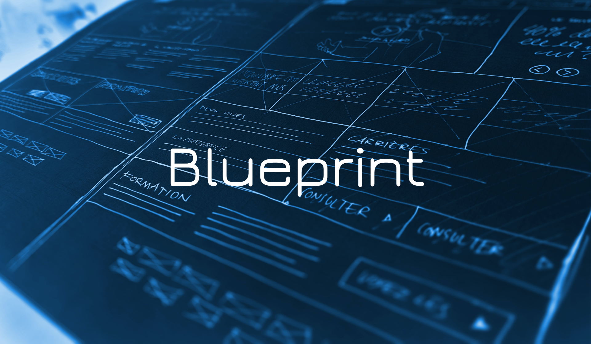

[style: very good analysis][very_good_analysis_link]

Built with Flutter 💙 and Firebase 🔥

---

## Blueprint

This is a task manager for multiple projects. It allows you to manage your tasks in one place, even if they are in different platforms. It is built with Flutter, so it can run on web for now, but other platforms support are about to come. 

## Getting started

Before setting up the project, you need to have the following tools installed:

- **Node.js** runtime environment (version 16.x.x)
- **Firebase CLI** tools
- **Flutter** SDK. It's recommended to install [fvm](https://fvm.app/) for flutter version management. 

### Installing

1. Clone this repository to your local machine.
```
git clone https://github.com/blueprinthub/firebase-blueprint.git
```

2. Navigate to the project directory.
```
cd blueprint
```

3. Install the required node packages.
```
yarn --cwd functions install
```
4. Install all flutter packages
```
flutter pub get
```

### Running the project

This project contains 3 flavors:

- [x] development
- [x] staging
- [x] production

To run the desired flavor either use the launch configuration in VSCode/Android Studio or use the following commands:

```sh
# Development
$ flutter run --flavor development --target lib/main_development.dart --web-port=3000

# Staging
$ flutter run --flavor staging --target lib/main_staging.dart --web-port=3000

# Production
$ flutter run --flavor production --target lib/main_production.dart --web-port=3000
```

_\*Blueprint has official support only for web._

#### Local environment

There is another env called local which will use a combination of the development service account, and local emulators so we can test in a more isolated environment. This is the default environment to run for developers. 

1. First, let's set the environment variables file `.env` with the `local.env` provided inside the `functions` folder

```sh
cp functions/local.env functions/.env 
```

2. Then, we are going to serve the firebase project running via emulators. The emulators config can be found on `firebase.json` file at the root of the project. If your local machine uses the declared ports for other functions, you can change these ports for some available ports on your machine. Just make sure that you **do not commit changes on `firebase.json` file** after it. 


```sh
# Run Firebase Seeder
yarn --cwd functions serve:seed
```


This command will initialize Firebase emulators and add seed the `Firestore` instance with important data to run the project. You can find all emulators UI data at `http://locahost:4000`

3. Next, we are going to launch the project using the VSCode/Android Studio `Launch local` configuration, or by running the following command:

```sh
# Run local Flutter Client
$ flutter run --flavor development --target lib/main_development.dart --web-port=3000 --dart-define-from-file=./firebase.json
```

This should start a development session at `http://locahost:3000`. 


